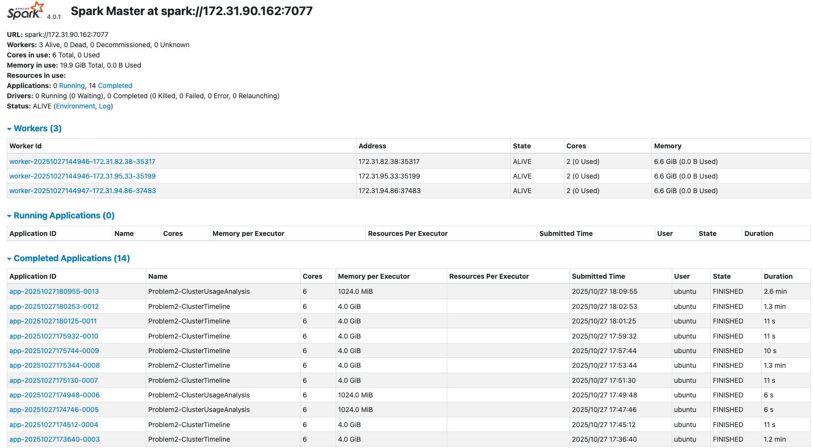

# Spark Log Analysis Report

## 1. Approach

### Problem 1 — Log Level Analysis
**Goal:** To process millions of raw log lines and identify how many belong to each log level (INFO, WARN, ERROR, DEBUG), producing summary statistics and representative samples for inspection.

By combining Spark’s distributed processing with regex-based parsing, this method efficiently handles tens of millions of records while preserving accuracy and scalability.
The intermediate caching and filtering minimized shuffle overhead and improved runtime.

**Steps:**
1. Loaded raw log data into PySpark.
2. Used regular expressions to extract log levels and messages.
3. Filtered valid log entries and grouped by `log_level` to compute counts.
4. Saved:
   - `problem1_counts.csv` — log level counts  
   - `problem1_sample.csv` — random log samples  
   - `problem1_summary.txt` — overview summary  

**Output Highlights:**
| Log Level | Count | Percentage |
|------------|--------|------------|
| INFO | 27,389,482 | 99.92% |
| WARN | 9,595 | 0.04% |
| ERROR | 11,259 | 0.04% |
| DEBUG | 0 | 0.00% |

---

### Problem 2 — Cluster Usage and Duration Analysis
**Goal:** To analyze Spark application execution logs, derive start and end times for each application, compute durations, and group workloads by cluster to understand usage intensity and runtime behavior.

**Approach:** This script reads and parses distributed Spark logs directly from local or S3 storage, extracts cluster and application identifiers, and uses timestamp parsing to measure job durations.
It then computes per-cluster application summaries and visualizes workload patterns through bar and density plots.

**Steps:**

1. Loaded log data recursively across all clusters and extracted:

   * `cluster_id`, `application_id`, and `app_number` from file paths.
   * Timestamps from each log line using regex and tolerant parsing (`try_to_timestamp`).
2. Filtered valid entries and computed:

   * `start_time` and `end_time` per application.
   * `duration_seconds` as the runtime difference.
3. Aggregated by cluster to summarize workload intensity (number of apps, first/last run).
4. Generated visualizations with `matplotlib` and `seaborn` for quick pattern recognition.
5. Output files:

   * `problem2_timeline.csv` — application start/end/duration
   * `problem2_cluster_summary.csv` — per-cluster app counts and timespans
   * `problem2_stats.txt` — textual summary of cluster and app distribution
   * `problem2_bar_chart.png` — bar chart of apps per cluster
   * `problem2_density_plot.png` — duration distribution for top cluster

**Output Highlights:**

* Extracted **application timelines** from raw logs with millisecond precision.
* Found **194 applications** across multiple clusters.
* Identified clusters with the highest workload concentration and visualized duration skewness.
* Used both **text summaries** and **plots** to provide interpretable operational insights.

---

## 2. Key Findings and Insights

### Problem 1

**Output Summary:**
Out of 33,236,604 total log lines, approximately 27.4 million contained valid log levels. Among those, the vast majority were informational messages:

| Log Level | Count      | Percentage |
| --------- | ---------- | ---------- |
| INFO      | 27,389,482 | 99.92%     |
| WARN      | 9,595      | 0.04%      |
| ERROR     | 11,259     | 0.04%      |
| DEBUG     | 0          | 0.00%      |

* **INFO** dominated the logs, reflecting normal operational activity.
* **WARN** and **ERROR** messages each accounted for less than 0.05%, suggesting minimal system issues or anomalies.
* **DEBUG** messages were absent, likely disabled in production settings.

This distribution indicates that the log data was largely healthy and informational, with negligible error frequency and no debugging noise.

### Problem 2

### **Overview of Clusters**

The dataset reports Spark job activity across 6 distinct cluster IDs, spanning September 2015 – July 2017.
Each cluster represents a distinct Spark deployment with its own application history.

| Cluster ID        | # of Applications | First App  | Last App   | Duration of Activity |
| ----------------- | ----------------- | ---------- | ---------- | -------------------- |
| **1485248649253** | 181               | 2017-01-24 | 2017-07-27 | ~6 months            |
| **1472621869829** | 8                 | 2016-09-09 | 2016-09-09 | ~2.5 hours           |
| **1448006111297** | 2                 | 2016-04-07 | 2016-04-07 | ~1.5 hours           |
| **1440487435730** | 1                 | 2015-09-01 | 2015-09-01 | ~5 minutes           |
| **1460011102909** | 1                 | 2016-07-26 | 2016-07-26 | ~25 minutes          |
| **1474351042505** | 1                 | 2016-11-18 | 2016-11-19 | ~2.5 hours           |

* Cluster 1485248649253 has the majoritiy of activity — it handled 181 applications over six months.
All others are short-lived or single-use clusters.

### **Timeline Insights**

From the `timeline` data:

* Application durations range widely — from seconds to hours.
* The longest single app: `application_1485248649253_0002` ran for ~15.5 hours (Feb 2017).
* Burst activity patterns appear — particularly around March 2017, where many jobs (e.g., apps 0012–0024) ran sequentially or overlapped, likely indicating batch job processing.
* For Cluster 1485248649253, workloads seem to occur in waves (Feb → Mar → Apr → Jun 2017), suggesting periodic analytics or data pipelines.

### **Summary Takeaways**

1. **Temporal trend:** Cluster usage expanded over time, peaking in 2017.
2. **Dominant workload:** Nearly all computation is concentrated in a single long-lived cluster (ID 1485248649253).
3. **Workload diversity:** Job runtimes vary drastically — from seconds to hours — suggesting a mix of quick queries and heavy ETL/aggregation tasks.
4. **Operational stability:** The main cluster sustained continuous workloads for half a year, implying stable Spark infrastructure.
5. **Early clusters (2015–2016)** likely represent testing or smaller-scale jobs before full-scale deployment in 2017.

---

## 3. Performance Observations

### Problem 1

**Execution**

- Full run over 33,236,604 lines completed in ~3.1 min.

- A warm re-run after environment priming finished in ~6 s (small cache effects; also metadata and classloader/JIT warming).

- The job is I/O bound: single pass of line parsing + lightweight regex + aggregations (groupBy on 4 log tokens).

**Possible optimizations**

* Vectorized operations: Use `pandas` or `numpy` vectorized functions instead of iterating row by row.
* Pre-aggregate timestamps: Compute `first_app` and `last_app` per cluster with `groupby().agg()` instead of manual loops.
* Memory optimization: Convert timestamps to `datetime64[ns]` and IDs to categorical types to reduce memory footprint.
* Parallel processing: Use multiprocessing or `dask` for large datasets when computing cluster summaries.
* Efficient I/O: Read/write CSVs with `chunksize` for very large files instead of loading everything into memory.

### Problem 2

**Execution**

Problem 2 appears to have two different job types: `Problem2-ClusterUsageAnalysis` and `Problem2-ClusterTimeline`.

### Execution Times for Problem 2

| Application Name | Durations | Observations |
| :--- | :--- | :--- |
| **`Problem2-ClusterUsageAnalysis`** | 2.6 min, 6 s, 6 s | The longest duration for this analysis is 2.6 min, while two other runs were significantly faster at 6s each. |
| **`Problem2-ClusterTimeline`** | 1.3 min, 11 s, 11 s, 10 s, 1.3 min, 11 s, 1.2 min | The durations for the timeline job vary, ranging from 10s up to 1.3 min. There are three runs around 1.2-1.3 mins and four runs that took about 10-11s. |

This variation are partially due to my runnning and debugging the code in the development process.

**Possible optimizations**

* Vectorized duration calculation: Compute `duration_seconds` directly using `end_time - start_time` in pandas.
* Sort once: Sort applications by `start_time` per cluster in a single operation instead of repeated sorting.
* Minimize repeated lookups: Use `merge` or `map` instead of repeatedly querying cluster summaries.
* Pre-compute aggregates: If computing max/min/mean durations per cluster, do it via `groupby().agg()` instead of manual loops.
* Lazy evaluation: For very large datasets, consider `polars` or `dask` for out-of-core computation.

---

## 4. Spark Web UI 

---

## 5. Explanation of Visualizations (Problem 2)

### Bar Chart — `problem2_bar_chart.png`

- According to the bar chart, cluster 1485248649253 dominates with 181 applications, while the other five clusters have 8, 2, 1, 1, 1 applications respectively. The workload is heavily concentrated on a single cluster (181 apps), with a long tail of lightly used clusters. This informs where we should focus performance or cost optimization work (e.g., the busy cluster’s storage locality, caching, or shuffle tuning). However, the bar chart counts applications, not work. A cluster with fewer applications could still have longer or heavier jobs.

### Density Plot — `problem2_density_plot.png`

- This plot visualizes the number of jobs in bins according to their duration.

- Each bar is a bin that spans a duration range. The left side of the x-axis captures very short jobs (tens of seconds), while the right tail captures long-running jobs (thousands to tens of thousands of seconds).

- The KDE line helps us see where durations cluster and whether the distribution is unimodal or shows multiple regimes (e.g., very short housekeeping tasks vs. longer compute jobs).

Biggest takeaways:

- The distribution is right-skewed. Most applications complete quickly, but there is a small number of long jobs, suggesting either heavier pipelines or periods of contention.

- The visualization's shape suggests two things:

    - Many shorter, routine jobs.
    - Fewer, larger jobs that drive most of the cluster time (and likely most of the cost).

